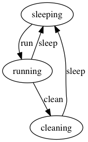

# RedisFSM

RedisFSM (fsm) is a [Redis](https://redis.io/) module that implement a toy Finite State Machine (FSM)
for Redis Hashes.
RefisFSM is built using [redismodule-rs](https://crates.io/crates/redis-module) an idiomatic Rust API
for the [Redis Modules API](https://redis.io/docs/reference/modules/).

## Build

Make sure you have Rust installed:
https://www.rust-lang.org/tools/install

Then, build as usual:

```bash
cargo build
```

Make sure you have Redis installed.

## Run

### Linux

```
redis-server --loadmodule ./target/debug/libredis_fsm.so
```

### Mac OS

```
redis-server --loadmodule ./target/debug/libredis_fsm.dylib
```

### An Example

To represent a state machine as depicted below:



You can use a JSON payload to `FSM.CREATE` like:

```json
{
  "name": "JobFSM",
  "prefix": "job:",
  "field": "state",
  "states": [
    "sleeping",
    "running",
    "cleaning"
  ],
  "events": [
    {
      "name": "run",
      "from": [
        "sleeping"
      ],
      "to": "running"
    },
    {
      "name": "clean",
      "from": [
        "running"
      ],
      "to": "cleaning"
    },
    {
      "name": "sleep",
      "from": [
        "running",
        "cleaning"
      ],
      "to": "sleeping"
    }
  ]
}
```
Here's an example run on the Redis CLI:

```
127.0.0.1:6379> KEYS *
(empty array)
127.0.0.1:6379> FSM.CREATE "{\"name\":\"JobFSM\",\"prefix\":\"job:\",\"field\":\"state\",\"states\":[\"sleeping\",\"running\",\"cleaning\"],\"events\":[{\"name\":\"run\",\"from\":[\"sleeping\"],\"to\":\"running\"},{\"name\":\"clean\",\"from\":[\"running\"],\"to\":\"cleaning\"},{\"name\":\"sleep\",\"from\":[\"running\",\"cleaning\"],\"to\":\"sleeping\"}]}"
(integer) 1
127.0.0.1:6379> FSM.INFO "JobFSM"
{"name":"JobFSM","prefix":"job:","field":"state","states":["sleeping","running","cleaning"],"events":[{"name":"run","from":["sleeping"],"to":"running"},{"name":"clean","from":["running"],"to":"cleaning"},{"name":"sleep","from":["running","cleaning"],"to":"sleeping"}]}
127.0.0.1:6379> HMSET job:for:your:momma k1 v1 k2 v2
OK
127.0.0.1:6379> HGETALL "job:for:your:momma"
1) "k1"
2) "v1"
3) "k2"
4) "v2"
5) "state"
6) "sleeping"
127.0.0.1:6379> FSM.ALLOWED JobFSM job:for:your:momma clean
(integer) 0
127.0.0.1:6379> FSM.ALLOWED JobFSM job:for:your:momma run
(integer) 1
127.0.0.1:6379> FSM.TRIGGER JobFSM job:for:your:momma run
(integer) 1
127.0.0.1:6379> HGETALL "job:for:your:momma"
1) "k1"
2) "v1"
3) "k2"
4) "v2"
5) "state"
6) "running"
127.0.0.1:6379>
```

## License

MIT